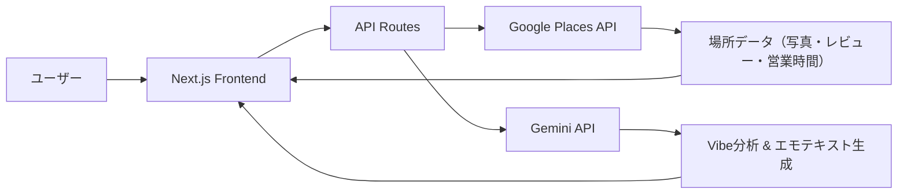

# VibesMap 実装計画

「気分（Vibe）」で場所を探すWebアプリの実装計画。既存のNext.jsモックをベースに、Google Places API + Gemini LLMを統合し、実データ駆動のアプリに進化させる。

## 技術スタック（モック解析結果）

| レイヤー | 技術 |
|---|---|
| **フレームワーク** | Next.js 16（App Router / Turbopack） |
| **UI** | React 19 + shadcn/ui + Radix UI |
| **スタイル** | TailwindCSS 3 + ネオンデザインシステム |
| **言語** | TypeScript 5.7 |
| **フォント** | Inter + Space Grotesk |
| **外部API** | Google Places API (New) / Gemini API |

## アーキテクチャ概要



---

## Proposed Changes

### 1. 環境設定とユーティリティ

#### [NEW] .env.local
- `GOOGLE_PLACES_API_KEY` と `GEMINI_API_KEY` の環境変数定義
- `.env.local.example` も同時作成

#### [NEW] lib/types.ts
- `Spot` / `VibeType` / API レスポンス型を一元管理
- 既存の `spot-card.tsx` と `vibe-selector.tsx` に散在する型定義を集約

---

### 2. バックエンドAPI（Next.js API Routes）

#### [NEW] lib/google-places.ts
- Google Places API (New) クライアント
  - `searchNearby(location, types, vibes)` — 近隣の場所をテキスト検索
  - `getPlaceDetails(placeId)` — 写真URL・レビュー・営業時間の取得
  - `getPhotoUrl(photoReference)` — 写真URL生成

#### [NEW] lib/gemini.ts
- Gemini API クライアント（`@google/genai` SDK使用）
  - `analyzeVibes(placeData, selectedVibes)` — 場所データ+Vibeからエモーショナルな説明文を生成
  - `generateVibeScore(placeData, selectedVibes)` — Vibeスコア（0-100）を算出
  - `generateWhyNow(placeData)` — 「今、ここに行くべき理由」を生成

#### [NEW] app/api/spots/route.ts
- `GET /api/spots?q=...&vibes=...&lat=...&lng=...`
- フロー:
  1. Google Places API で場所を検索
  2. 各場所に対して Gemini でVibe分析
  3. スコア・エモ説明付きの `Spot[]` を返却

#### [NEW] app/api/spots/[id]/route.ts
- `GET /api/spots/:id`
- フロー:
  1. Google Places API で詳細取得
  2. Gemini で「今、ここに行くべき理由」テキスト生成
  3. 詳細情報 + エモテキストを返却

---

### 3. フロントエンド改修

#### [NEW] hooks/use-spots.ts
- `/api/spots` と通信するカスタムフック
- 状態管理: `spots`, `loading`, `error`
- デバウンス付き検索

#### [MODIFY] components/interactive-explorer.tsx
- `useSpots` フック統合
- 検索 + Vibe選択 → API呼び出し → 結果表示の一連フロー

#### [MODIFY] components/search-bar.tsx
- 「Explore」ボタン押下時に `onSearch` コールバック発火

#### [MODIFY] components/spots-grid.tsx
- ハードコードされたダミーデータを削除
- props経由で `spots` を受け取るように変更
- ローディングスケルトン表示対応

#### [MODIFY] components/spot-card.tsx
- Google Places API の写真URLに対応
- 型定義を `lib/types.ts` からインポートに変更

---

### 4. スポット詳細ページ

#### [NEW] app/spots/[id]/page.tsx
- スポット詳細表示ページ
- Gemini生成の「今、ここに行くべき理由」セクション
- 写真ギャラリー / 営業時間 / アクセス情報

#### [NEW] components/spot-detail.tsx
- 詳細ページのメインコンポーネント
- ネオンデザインを踏襲したリッチな表示

---

### 5. UXポリッシュ

#### [NEW] components/spot-skeleton.tsx
- カード型のスケルトンローディング

#### [NEW] components/error-state.tsx
- API エラー時のフォールバックUI

---

## APIキーについて

> [!IMPORTANT]
> **APIキーが必要です**
> 1. **Google Places API Key** — Google Cloud Console から取得（Places API (New) を有効化）
> 2. **Gemini API Key** — Google AI Studio から取得

> [!WARNING]
> **API利用コストについて**
> - Google Places API: テキスト検索は1リクエストあたり約$0.032
> - Gemini API: 無料枠あり（1分間あたり15リクエスト）
> - 開発時はレート制限とキャッシュを考慮

---

## 検証計画

### ブラウザテスト
1. `npm run dev` でローカルサーバー起動
2. ブラウザで `http://localhost:3000` にアクセス
3. 以下を確認:
   - Vibe選択 → スポット一覧が更新されるか
   - 検索バーで場所名を入力 → 結果が表示されるか
   - スポットカードクリック → 詳細ページに遷移するか
   - 「今、ここに行くべき理由」テキストが表示されるか
   - ローディング中にスケルトンが表示されるか
   - APIエラー時にエラーUIが表示されるか

### ビルド検証
```bash
npm run build
```
- TypeScriptの型エラーがないことを確認
- ビルドが正常に完了することを確認
